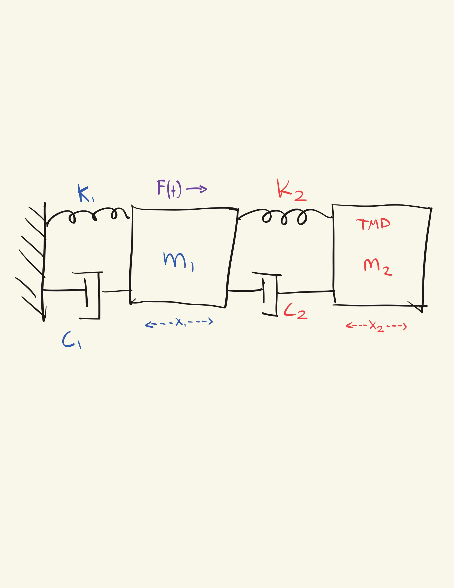
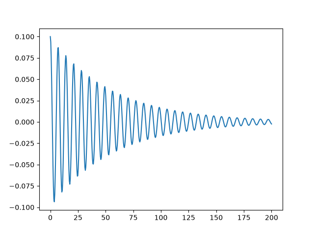
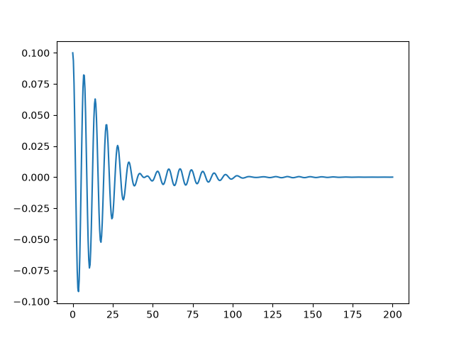
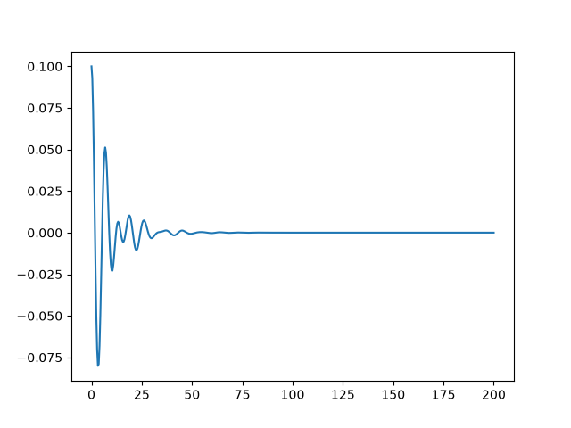

# TMD-Simulation

The purpose of this was too look into case of Taipei 101 and how the Tuned Mass Damper (TMD) works. Seeing directly through simulation how the TMD improves stability for structures going through external forces.

## Equations of Motion (EOM)

Variable Definitions:
- $m_1$: Mass of the building
- $k_1$: Natural springiness of the building
- $c_1$: Damping Coefficient of the building
- $x_1$: Postion of the Building
- $m_2$: Mass of the Tuned Mass Damper (TMD)
- $k_2$: Natural springiness of the TMD
- $c_2$: Damping coefficient of the TMD
- $x_2$: Position of the TMD

### Free Body Diagram



To start the project, we need to understand the building's motion through physics. Using Newton's second law, we can treat the building as a single mass, $m_1$, and add up every force acting on it:

```math
m_1 \ddot{x}_1 = F(t)  - c_1\dot{x}_1-k_1x_1
```

Three forces act on the building: the external force $F(t)$ pushing it (wind or an earthquake), a spring force pulling it back ($-k_1x_1$), and a damping force resisting its motion ($-c_1\dot{x}_1$). Making these equal to mass times acceleration gives the building's equation of motion.

Adding the TMD introduces a second mass, $m_2$, connected to the building instead of the ground, so the coupling terms depend on the position $`(x_1-x_2)`$ and motion $`(\dot{x}_1-\dot{x}_2)`$ rather than either mass alone. The TMD feels no external force directly, only the reaction from that spring and damper by Newton's third law. Writing Newton's second law for both masses gives the system below:


```math
\begin{gathered}
\therefore m_1 \ddot{x}_1 = F(t) - c_1\dot{x}_1-k_1x_1 - c_2(\dot{x}_1-\dot{x}_2) - k_2(x_1-x_2)
\\
m_2 \ddot{x}_2 = -c_2(\dot{x}_2 - \dot{x}_1)- k_2(x_2 - x_1)
\end{gathered}
```

## Solving EOM Variables

From Chung et al., the Taipei 101 tower is: $`m_1=52969mt,\ k_1=42250kN/m,\ \zeta_1=0.02`$.

Checking natural frequency:
```math
f_n\equiv\frac{1}{2\pi}\sqrt{\frac{k}{m}} \Rightarrow f_n=0.1425Hz
```

Damping coefficient comes out to:
```math
\begin{gathered}
c\equiv2\zeta\omega_n m \Rightarrow c_1 = 2 (0.02)(2\pi\times0.1425Hz)(52969mt)\\ c_1=1897kN\cdot s / m
\end{gathered}
```

So we have $`m_1,\ k_1,\ c_1`$, but we are missing the properties of the TMD: $`m_2,\ k_2,\ c_2`$.

The key to solving the TMD variables is using Den Hartog's equations, which can give us the optimal $k_2$ and $c_2$ with just $m_2/m_1$ by his work:
```math
\begin{gathered}
f_{opt}=\frac{\omega_2}{\omega_1}=\frac{1}{1+\mu}:\ \mu=\frac{m_2}{m_1}\\ \ \\
\zeta_{opt}=\sqrt{\frac{3\mu}{8(1+\mu)^3}}
\end{gathered}
```

From this we can find $k_2$ by:
```math
\begin{gathered}
\omega_2=\frac{\omega_1}{1+\mu},\ \omega_2\equiv\sqrt{\frac{k_2}{m_2}} \\ \ \\
\Rightarrow \frac{\omega_1}{1+\mu}=\sqrt{\frac{k_2}{m_2}}\\ \ \\
k_2=m_2\left(\frac{\omega_1^2}{(1+\frac{m_2}{m_1})^2}\right)\\ \ \\
\therefore k_2 = \frac{m_1^2 m_2 \omega_1^2}{(m_1+m_2)^2}
\end{gathered}
```

Then we can find $c_2$ by:
```math
\begin{gathered}
c_2\equiv 2 \zeta_{opt}\omega_2m_2 \Rightarrow c_2=2\omega_2m_2\sqrt{\frac{3m_2}{8m_1(1+\frac{m_2}{m_1})^3}}\\
\therefore c_2 = \sqrt{\frac{3}{2}}\frac{m_1^2 m_2^{3/2} \omega_1}{(m_1+m_2)^{5/2}}
\end{gathered}
```

This leaves us with a single variable, $m_2$. All the other variables are:

```math
\begin{gathered}
m_1=52969mt\\
k_1=42250kN/m\\
c_1=1897kN\cdot s/m\\ \ \\
k_2 = \frac{m_1^2 m_2 \omega_1^2}{(m_1+m_2)^2}\\ \ \\
c_2 = \sqrt{\frac{3}{2}}\frac{m_1^2 m_2^{3/2} \omega_1}{(m_1+m_2)^{5/2}}
\end{gathered}
```

## Building the Sim

We can find the optimal mass of the TMD using a sim.

```python
import numpy as np
import matplotlib.pyplot as plt
from scipy.integrate import solve_ivp

M1 = 52969000.0
K1 = 42250000.0
C1 = 1897000.0
OMEGA1= np.sqrt(K1/M1)
M2 = 660000
K2 = (M1**2 * M2 * OMEGA1**2)/((M1+M2)**2)
C2 = np.sqrt(1.5) * (M1**2 * M2**(1.5) * OMEGA1)/((M1 + M2)**(2.5))


def main():
    t0, tf, t_steps = 0.0, 200.0, 500
    y0 = [0.1, 0.0, 0.0, 0.0]

    sol = solve_ivp(deriv, (t0, tf), y0, t_eval=np.linspace(t0, tf, t_steps), max_step=1e-3)
    
    t = sol.t
    x1, x2, v1, v2 = sol.y
    a1 = (disturbance(t) - C1*v1 - K1*x1 - C2*(v1 - v2) - K2*(x1-x2))/M1

    print(f"The Mass of the TMD: {int(M2/1000)}mt")
    print(f"RMS Building Acceleration: {rms(a1):.04f}m/s^2")
    print(f"Peak Building Acceleration: {np.max(np.abs(a1)):.04f}m/s^2")
    
    plt.plot(t, x1)
    plt.show()

def deriv(t,y):
    x1, x2, v1, v2 = y
    a1 = (disturbance(t) - C1*v1 - K1*x1 - C2*(v1 - v2) - K2*(x1-x2))/M1
    a2 = (-C2*(v2-v1) - K2*(x2 -x1))/M2
    return [v1, v2, a1, a2]

    
def disturbance(t):
    return 0


def rms(x):
    return np.sqrt(np.mean(x**2))

if __name__=="__main__":
    main()
```

## Simulation Results
Building sway, TMD = 0

RMS Building Acceleration: $2.12cm/s^2$

Peak Building Acceleration: $7.98cm/s^2$



Real-life Accurate Sway with TMD = 660 mt:

RMS Building Acceleration: $1.47cm/s^2$

Peak Building Acceleration: $8.07cm/s^2$



Unrealistic Building Sway with TMD = 10000mt 

RMS Building Acceleration: $1.01cm/s^2$

Peak Building Acceleration: $9.04cm/s^2$


## Conclusion
Our simulation shows peak acceleration rising as RMS acceleration falls with increasing TMD mass. The Taipei 101 engineering team most likely settled on 660mt primarily due to cost and size constraints. They likely also modeled additional factors like human movement, earthquakes, wind, rain, and found that in order to comply with standards such as ISO10137, the TMD could not be above 660mt.
